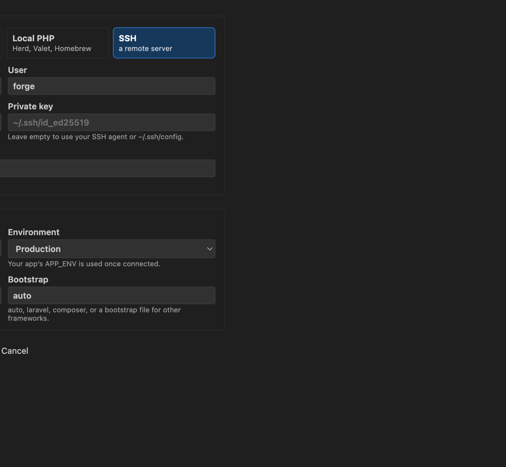
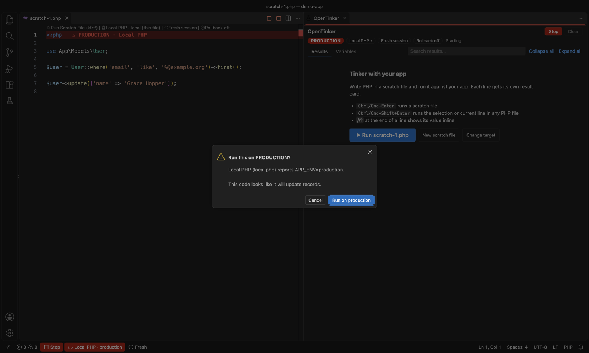

# OpenTinker

A scratchpad for Laravel and PHP inside VS Code. Write code in a scratch file, press
**Cmd/Ctrl+Enter**, and see what every line did: its value at the end of the line, and a
results panel with model cards, tables, dumps, SQL and errors. Code runs in your app's
real runtime: Docker, local PHP or SSH.


> OpenTinker is in preview. Please [report anything that doesn't work](https://github.com/Spicy-Brain/OpenTinker/issues).

## Features

- **Fresh runs by default.** Every run starts from a freshly booted app, so re-running
  a file never trips over leftover state. Laravel boots once and each run forks from it,
  so a run typically takes 10–40 ms. Switch to **keep session** for a REPL.
- **Results per line.** Values at the end of each line, and a card per statement with
  timing, SQL and whether the result changed since the last run.
- **Eloquent model cards, tables, dumps and previews** of mailables, responses and HTML.
- **SQL insight** with bindings, timings and N+1 warnings.
- **Safe production runs.** Production targets turn red, and runs ask first when the code
  looks like it writes data. Database changes can be rolled back after each run.
- **Fake side effects.** Mail, notifications, jobs and Laravel HTTP client calls can be
  faked, and each result card shows what it would have sent, with a preview of each
  email.
- **Your real runtime.** Docker Compose (Sail included), `docker exec`, local PHP (Herd,
  Valet, Homebrew) or SSH, detected automatically on the first run.
- **Run code from anywhere:** a selection in any PHP file, a model ("Tinker this model"),
  a method, the clipboard, or a shared snippet with inputs.

## Requirements

- VS Code 1.90 or later. OpenTinker is also on Open VSX for Cursor, Windsurf and
  VSCodium.
- A PHP project with its Composer dependencies installed, using **PHP 8.1 or later**
  where the app runs. Laravel 10–13 and plain Composer projects are tested.
- **PsySH** in the project. Laravel apps have it through `laravel/tinker`; otherwise run
  `composer require --dev psy/psysh`.
- For fast fresh runs, the `pcntl` and `posix` PHP extensions. Most Linux and macOS PHP
  builds have them. The official `php` Docker images need
  `docker-php-ext-install pcntl`. Without them, OpenTinker restarts PHP for each fresh
  run instead, which is slower.
- For Docker targets, the `docker` CLI with Compose v2. For SSH targets, the `ssh`
  command with key or agent authentication.

OpenTinker runs on macOS and Linux. On Windows, use it in a WSL window (Remote - WSL);
native Windows PHP is experimental.

## Getting started

1. Open your project and run **OpenTinker: Open Tinker Window** (the flask icon in the
   activity bar, or the command palette). It opens a scratch file on the left and
   results on the right.
2. Write PHP and press **Cmd+Enter** (macOS) or **Ctrl+Enter**, or click **▶ Run** in
   the status bar, the editor toolbar or the results panel.

The first run finds where your app runs by itself. It reads your Compose file
(including Sail, and projects that mount sub-folders such as `./app`), checks which
services are running, and falls back to local PHP. It only asks when there is more
than one real option. The chosen target shows in the status bar; click it to change.

## How runs work

- **Fresh by default.** Nothing carries over between runs: variables, imports,
  functions or classes you declare, or changes to the service container.
- **Keep session** (status bar, CodeLens or panel toggle) makes variables carry over
  between runs, like `artisan tinker`. **Reset session** clears it instantly.
- **Stop** ends a run right away, and the app stays booted for the next run.
- **Roll back database changes** (toggle) runs code in a transaction and undoes it, so
  you can try `update()` or `delete()` safely. Mail, queues, files and external calls
  are not rolled back.
- **Fake side effects** (toggle, Laravel only) captures mail instead of sending it, and
  swaps in Laravel's fakes for notifications, queued and dispatched jobs, and requests
  made with Laravel's `Http` client. Nothing is sent; each statement's card lists what
  it would have sent. Events, files and cache stay real, and queued listeners are
  captured as jobs. SDKs that make their own HTTP requests (payment providers, for
  example) are not faked. Together with rollback, you can try a whole workflow without
  touching anything outside the run. If a target can't fake them, OpenTinker won't run
  with the toggle on.
- `dd()` shows its values and ends the run cleanly. So do `exit()` and `die`, including
  when they come from app code.

## Results

- **Inline results** at the end of each line: the value it returned, `dump()` output,
  or the error in red. Hover for the full text. Edits move or clear them.
- **PHP warnings and notices** (an undefined variable or array key) show in the results;
  deprecations don't.
- **Lazy values are left alone.** Cursors, lazy collections and generators show their
  type without being run or consumed, so `User::cursor()` doesn't query every row just
  to display it.
- **Result cards** in source order, one per statement, with timing, query count and a
  marker when the result changed since the last run of the file.
- **Eloquent models** render as cards: attributes with casts, hidden fields, loaded
  relations and unsaved changes. The raw dump is always one click away.
- **Tables** for collections and lists of arrays, with filtering.
- **Copy** any value as text, JSON, a PHP array, CSV or a Markdown table.
- **SQL** per statement with bindings and timings. Repeated query shapes are flagged as
  a possible N+1.
- **Errors** lead with the message and your scratch line. App frames open in the
  editor; vendor frames are collapsed and PsySH/OpenTinker internals are hidden.
- **Mailables, HTTP responses and HTML** preview in a sandboxed frame with scripts
  off. Remote images stay blocked until you load them, so previewing an email doesn't
  trigger its tracking pixels.
- **Variables** tab: what the last run left behind, or the kept session's variables.
- End a line with `//?` to show that value inline even when it is not the last
  statement.

Results open beside the scratch file by default. Set `opentinker.results.location` to
`panel` to put them in the bottom panel next to Terminal.

## Running code from anywhere

- **Cmd/Ctrl+Shift+Enter** runs the selection, or the current line, in any PHP file.
  Earlier top-level `use` statements from that file are applied without running the
  rest of it.
- **Tinker this model** (CodeLens on Eloquent models) opens a scratch file that loads
  the model and runs it.
- **Run method / Run function** (CodeLens) calls public methods and functions that take
  no required arguments.
- **OpenTinker: Run Clipboard** runs whatever you copied.
- **Snippets** are PHP files in `.tinker/snippets/` with a small header, so a team can
  commit and share them. Inputs such as `{{userId:number}}`, `{{email}}`,
  `{{active:bool}}` and `{{payload:json}}` open a form before the snippet runs.

## Targets

A target is a saved place to run code: a **Docker Compose** service, a **Docker
container**, **local PHP**, or an **SSH** server. Each target has a name, the project
path inside the runtime, an optional PHP binary and bootstrap, and a declared
environment. Manage targets with **OpenTinker: Choose Target…**; the gear opens a
single form with a **Test connection** button.



Scratch files can remember their own target (**Choose Target for This File…**), so a
production scratch and a local scratch can be open side by side. The CodeLens on line
1 always shows which target a file runs on.

### Production safety

A target counts as production when the app reports `APP_ENV=production` or the target
is declared as production. Then:

- the status bar item turns red, and scratch files get a red **PRODUCTION** band on
  line 1;
- runs ask first when the code looks like it changes data or has side effects (saves,
  updates, deletes, jobs, mail, Artisan commands, cache and file writes). Set
  `opentinker.production.confirm` to `always` or `never` to change this.



The check is a heuristic that errs towards asking, not a sandbox. Code you confirm runs
with your app's full permissions.

### SSH

OpenTinker uses the system `ssh` command with key or agent authentication and strict
host key checking. It never accepts a new host key automatically, so connect once in a
terminal first. It uploads its worker to a private folder under the remote user's home.
SSH details can be imported from
[OpenVSDB](https://marketplace.visualstudio.com/items?itemName=snitzle.openvsdb);
imported targets are re-checked against OpenVSDB before every run. A database tunnel
host is often only a bastion, so set the host that actually runs the app.

### Other frameworks and plain PHP

The worker boots Laravel when `bootstrap/app.php` exists and otherwise loads Composer's
autoloader. For other frameworks, set the target's (or `opentinker.bootstrap`)
bootstrap to a PHP file that boots your app.

## Autocomplete in scratch files

Scratch files are ordinary PHP files, so Intelephense and other PHP extensions complete
them. **OpenTinker: Generate Model Hints** writes `.tinker/_ide_helper_models.php` from
your database schema, so `$user->` completes real columns. It uses the same approach as
`barryvdh/laravel-ide-helper`. **Check Setup** warns if Intelephense excludes the
scratch folder.

## Commands

| Command                              | What it does                                          |
| ------------------------------------ | ----------------------------------------------------- |
| Open Tinker Window                   | Latest scratch file on the left, results on the right |
| Run (Cmd/Ctrl+Enter in scratch)      | Run the scratch file, or the selection                |
| Run Selection or Line (+Shift)       | Run the selection or current line of any PHP file     |
| Run Clipboard                        | Run the clipboard contents                            |
| Stop Run                             | Stop the current run; the app stays booted            |
| Choose Target… / … for This File     | Pick, detect, add or edit targets                     |
| Toggle Fresh / Keep Session          | Switch how runs share state                           |
| Toggle Database Rollback             | Roll back database changes after each run             |
| Toggle Fake Side Effects             | Fake mail, notifications, jobs and HTTP calls         |
| Reset Kept Session                   | Clear the kept session's variables                    |
| New Scratch File / Open Scratch File | Scratch files live in `.tinker/`                      |
| Save Snippet / Run Snippet…          | Shareable snippets in `.tinker/snippets/`             |
| Search Run History                   | Search earlier runs by code, file, target or env      |
| Generate Model Hints                 | Column autocomplete for Eloquent models               |
| Follow Laravel Log                   | Tail the newest log file in an output channel         |
| Check Setup                          | Test the target and look for common problems          |
| Get Started                          | Open the walkthrough                                  |

## Settings

| Setting                             | Default      | Description                                                  |
| ----------------------------------- | ------------ | ------------------------------------------------------------ |
| `opentinker.session.mode`           | `fresh`      | `fresh`: each run starts clean. `keep`: variables carry over |
| `opentinker.database.rollback`      | `false`      | Roll back database changes after each run                    |
| `opentinker.fakeSideEffects`        | `false`      | Fake mail, notifications, jobs and HTTP calls (Laravel)      |
| `opentinker.production.confirm`     | `writes`     | When to confirm production runs: `writes`, `always`, `never` |
| `opentinker.results.location`       | `beside`     | `beside` the scratch file or in the bottom `panel`           |
| `opentinker.inlineResults`          | `true`       | Show results at the end of each line                         |
| `opentinker.codeLens.runMethods`    | `true`       | Show Run method / Run function on callable methods           |
| `opentinker.codeLens.tinkerModel`   | `true`       | Show Tinker this model on Eloquent models                    |
| `opentinker.bootstrap`              | `auto`       | `auto`, `laravel`, `composer` or a bootstrap file path       |
| `opentinker.timeoutMs`              | `30000`      | Stop runs after this long (0 disables)                       |
| `opentinker.executionMode`          | `statements` | A card per statement, or one card for the whole file         |
| `opentinker.scratchDir`             | `.tinker`    | Scratch folder (snippets live in its `snippets/` folder)     |
| `opentinker.docker.workingDir`      | `/var/www`   | Default project path for new container targets               |
| `opentinker.php.binary`             | `php`        | PHP binary for local targets                                 |
| `opentinker.ssh.phpBinary`          | `php`        | PHP binary on SSH targets                                    |
| `opentinker.maxOutputBytes`         | `2097152`    | Output kept per run                                          |
| `opentinker.history.maxEntries`     | `50`         | Runs kept in history                                         |
| `opentinker.history.persistResults` | `false`      | Keep results across reloads (they may contain app data)      |

### Keyboard shortcuts

Cmd/Ctrl+Enter is bound only in scratch files, and Cmd/Ctrl+Shift+Enter in any PHP
file. Other keymap extensions can take these keys (the IntelliJ IDEA keymap binds
Cmd/Ctrl+Enter to "insert line break"). **Check Setup** detects this and copies a
keybinding for you to paste into `keybindings.json`:

```json
{
    "key": "cmd+enter",
    "command": "opentinker.run",
    "when": "editorTextFocus && opentinker.isScratch"
}
```

The Xdebug extension's "Run PHP File" button runs host PHP without your app. In scratch
files, OpenTinker adds its own Run button to the editor toolbar and is also the first
entry in the editor's run menu.

## Privacy and security

- OpenTinker runs arbitrary PHP in your application, with the same power as
  `php artisan tinker`. It only works in trusted workspaces and never runs code without
  an explicit action.
- It has no telemetry and makes no network requests of its own. It talks only to the
  runtime you choose: a local PHP process, `docker`, or `ssh`.
- Targets and run history (code and run details) are kept in VS Code's workspace
  storage on your machine. Results stay in memory unless you turn on
  `opentinker.history.persistResults`; turning it off again deletes them.
- Scratch files live in `.tinker/` in your project. OpenTinker offers to add it to
  `.gitignore`, while letting shared snippets in `.tinker/snippets/` be committed.

Please report security issues privately; see [SECURITY.md](SECURITY.md).

## Known limitations

- One project per window: in a multi-root workspace OpenTinker uses the first folder
  that contains `artisan`, else `composer.json`.
- Rollback covers the default database connection only.
- Without `pcntl`, fresh runs restart PHP each time and a stopped run restarts the
  worker.

## Contributing

Bug reports and pull requests are welcome. See [CONTRIBUTING.md](CONTRIBUTING.md) for
how to build and test OpenTinker, and the [roadmap](docs/roadmap.md) for what's next.

## License

[MIT](LICENSE). OpenTinker is built on [PsySH](https://psysh.org). It is an independent
project and is not affiliated with or endorsed by Laravel. Laravel is a trademark of
Laravel Holdings Inc.
